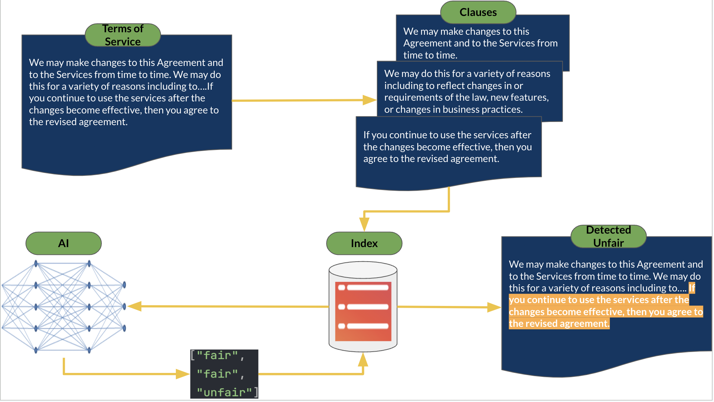
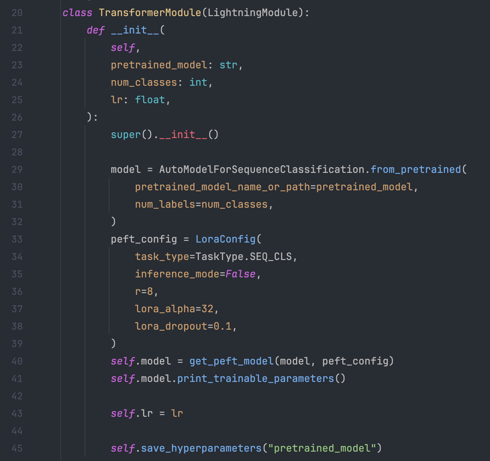
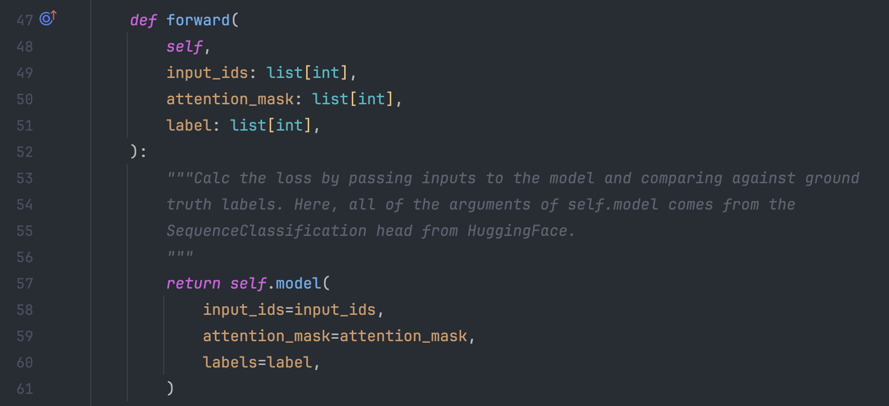
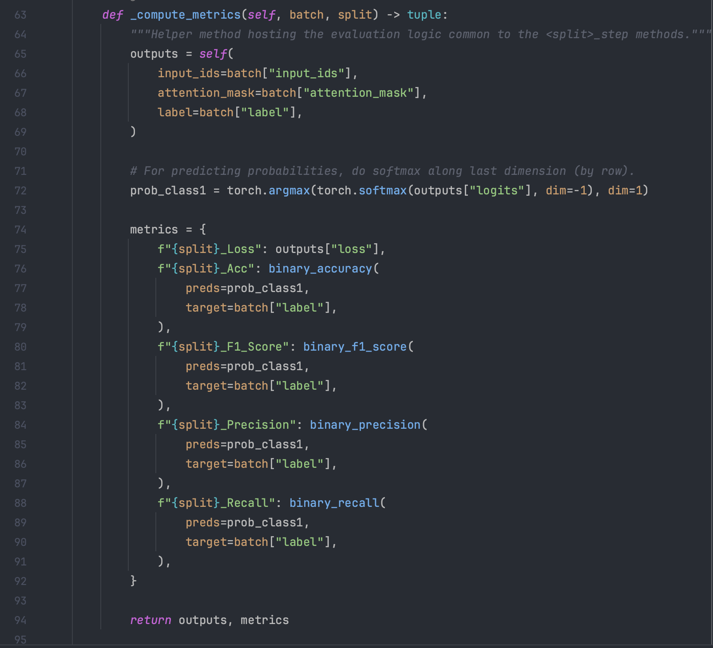
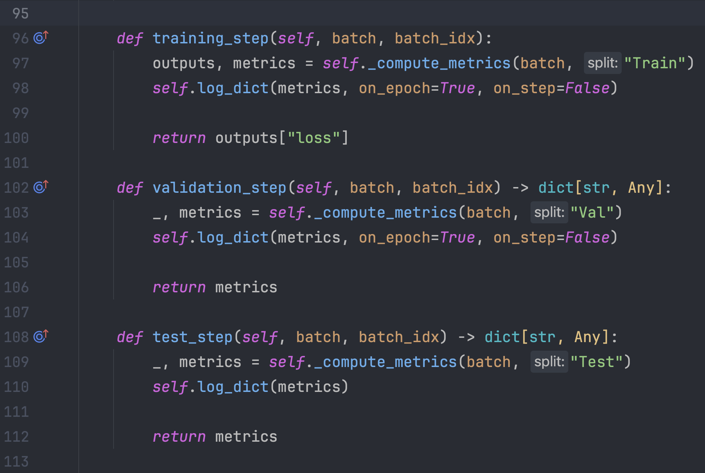
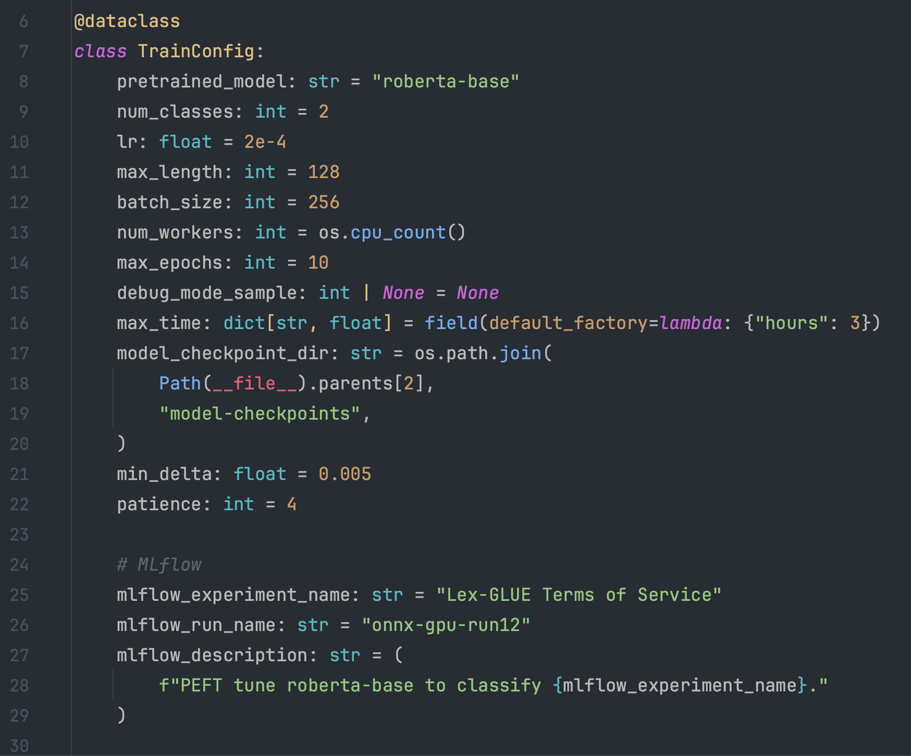
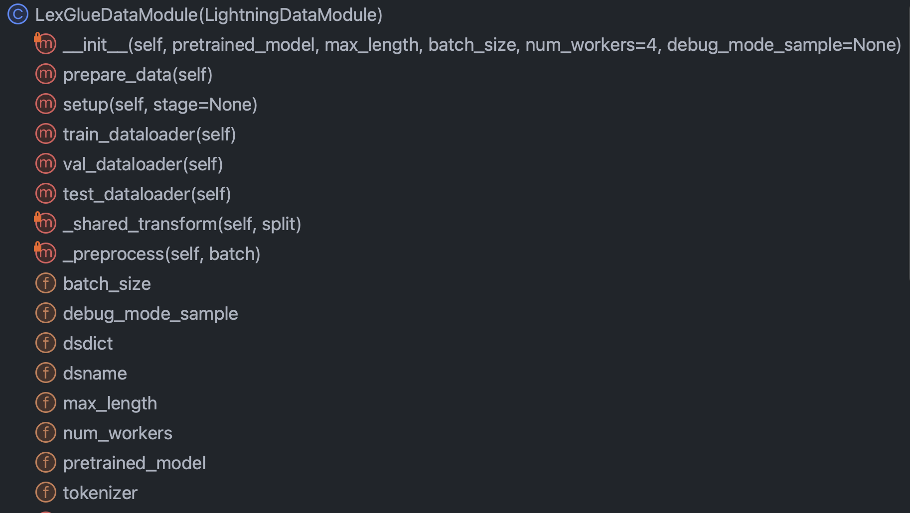
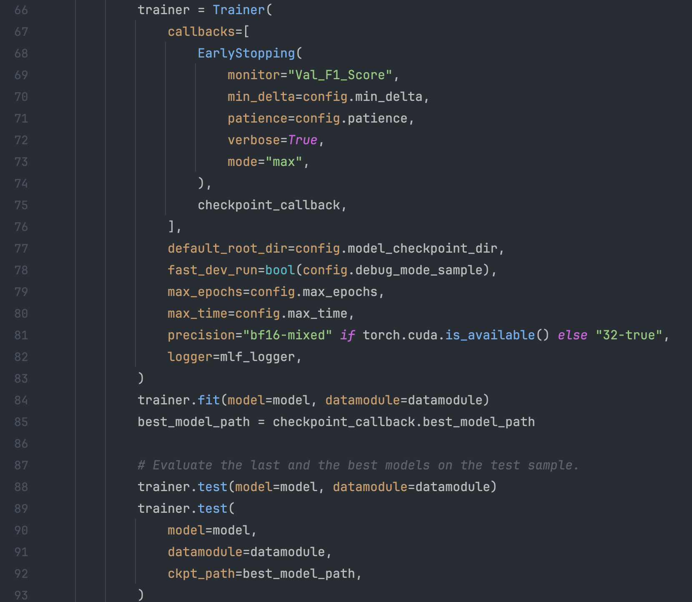
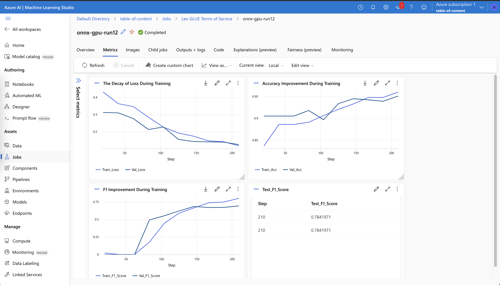

# 🔥 Build Your Custom AI/LLM With PyTorch Lightning

## Introduction
Processes and information are at the heart of every business. The vulnerability and opportunity of this moment is the question of whether your business can automate your processes using AI, and reap the rewards of doing so. ChatGPT, a general purpose AI, has opened our eyes to what AI can do. What matters now is directing the power of AI to *your* business problems and unlock the value of *your* proprietary data. In this document, I will show you how.

## Table of Contents
1. [Overview of LLM Fine Tuning](#1-overview-of-llm-fine-tuning)
2. [Problem Background](#2-problem-background)
3. [Architecture of the AI System](#3-architecture-of-the-ai-system)
4. [Code Deep Dive](#4-code-deep-dive)
5. [Model Results](#5-model-results)
6. [Installation and Quick Start](#6-installation-and-quick-start)
7. [Contribute](#7-contribute)
8. [References](#8-references)

## 1. Overview of LLM Fine Tuning
You don't want an AI that can just chat; what you really want are automations that perform 
the work that keeps your business running--powering through business processes at 
unparalleled accuracy and scale. The proven way to customize AI to your business 
processes is to fine tune an LLM on your data and on the action you want AI to perform. 

Let's talk specifically about the fine tuning that we are going to do in this document 
and the technology behind it. Listed below are the five tools we will use extensively:

- **PyTorch Lightning** (gives us just enough control without excessive boilerplate)
- **HuggingFace** (access to thousands of community-maintained models)
- **Polars** (this data manipulation library is orders of magnitude faster than pandas 
  and is 
  really trending now)
- **Mlflow** (for tracking results during the process of fine tuning)
- **Azure ML** (we could've also gone with AWS SageMaker, but the user experience of 
  Azure ML 
  felt better)

At the end of the day, you should take away two things from this document:

- How to build deep learning models that attain state-of-the-art results 
- How the experience of building such models can be pretty easy when your mentality is 
  to build small, modular, and reusable components (something that PyTorch Lightning 
  facilitates)

I'm going to describe to you a hard, real-world problem, what machine learning 
researchers have already done, and the new frontier we have been able to push to using 
powerful, SOTA tools. We're going to train models on GPUs in the cloud. We're also going 
to put powerful MLOps practices into action--using MLflow to organize our experiments 
and parameters. And along the way, I'm going to point out the design pattern of this 
project so that you can customize the codebase for your own deep learning projects.  

Let's start with the problem background.


## 2. Problem Background
A good process for finding suitable problems for machine learning and for quality datasets 
is to start by browsing sites with benchmarks. Benchmarks provide a frame of reference 
for the level of difficulty of the problem for machine learning, which we use to measure 
our progress during model development. One particular dataset with well established 
benchmarks is the [Unfair Terms of Service dataset (UNFAIR-ToS)](https://huggingface.co/datasets/lex_glue/viewer/unfair_tos); here's an intriguing 
problem statement for it: Use AI to find all unfair clauses in Terms of Service 
contracts. The context is that the European consumer law on unfair contracts establishes 
what unfair clauses are and the different types of unfair clauses. What makes UNFAIR-ToS 
perfect for text classification is that it has been manually labeled in accordance with 
that which was set down in the European law.

Chalkidis et al. (2021) applied eight different machine learning methods to UNFAIR-ToS 
and obtained macro F1 ranging from 75 to 83, and in Figure 1 just below, we excerpt from 
their published results.

#### Figure 1
| Method        | UNFAIR-ToS |          |
|---------------|------------|----------|
|               | micro F1   | macro F1 |
| TFIDF-SVM     | 94.7       | 75.0     |
| BERT          | 95.6       | 81.3     |
| RoBERTa       | 95.2       | 79.2     |
| DeBERTa       | 95.5       | 80.3     |
| Longformer    | 95.5       | 80.9     |
| BigBird       | 95.7       | 81.3     |
| Legal-BERT    | 96.0       | 83.0     |
| CaseLaw-BERT  | 96.0       | 82.3     |

Interesting things we can infer from this table are:

1. F1, not accuracy, is the authors' preferred metric 
2. macro F1 is a better differentiator than micro F1
3. all the deep learning models exhibit similar performance while SVM is materially worse 

Looking at the data, class imbalance is certainly present, which is a good reason for the 
first and second point above.

There are eight different types of unfair clauses. The authors of that paper developed 
multi-label classification models for the eight types, but we are simply going to 
build a binary classification model that classifies a clause as fair or unfair.

Let's design how we're going to do it.


## 3. Architecture of the AI System
#### Figure 2



## 4. Code Deep Dive
### 📝 Some Conventions to Know
* Functions are categorized as either helper functions or APIs. Python's single underscore protected notation is used here to tag a function as a helper function.  
* `__init__.py` exposes the public APIs of the module it is in so that we can conveniently shorten imports for deeply submoduled functionality like this example:

```python
from .fine_tune_clsify_head import TransformerModule
```

in `architectures/__init__.py` enables code outside `architectures` to import `TransformerModule` without having to remember the breadcrumbs leading to where this function sits, like this:

```python
from architectures import TransformerModule
```

### 🚶 A Tour of the Project
Here's what the project structure looks like from the root of the lightning_mlflow module:

```
.
├── architectures
│   ├── __init__.py
│   └── fine_tune_clsify_head.py
├── config
│   ├── __init__.py
│   └── train_config.py
├── data
│   ├── __init__.py
│   └── lex_glue.py
└── train.py
```

The key question is why the project is structured this way. And the answer is that 
separation of concerns is established between the 3 submodules and 1 entrypoint. Let's 
walk through each one of these modules in turn:

* `architectures`: specifies essentially everything PyTorch needs to know except for 
  the data  
* `config`: holds all the parameters and can be subdivided into `train_config.py` and 
  `inference_config.py` and whatever else
* `data`: holds all the data processing logic and settings
* `train.py`: the central point of control; this is the only piece of code that can see 
  `architectures`, `config`, and `data`; MLflow sdk calls go here
 
With this brief intro out of the way, let's roll up our sleeves and try to really 
understand the code in each of the modules. Let's start with 
[architectures/fine_tune_clsify_head.py](https://github.com/zjohn77/lightning-mlflow-hf/blob/70db3818f1fb8496a6f433eb0922519d21c1f33b/lightning_mlflow/architectures/fine_tune_clsify_head.py#L3). This code is organized like Figure 3 just 
below.

#### Figure 3


It's clear that the key methods inside this class to understand are: the constructor, 
the forward pass through the network, the metrics, and the steps. We'll discuss each of 
these in turn. Let's start with the constructor. This snippet is what the code looks like:

#### Figure 4


What's really crucial here is that the constructor loads a pretrained model from 
Huggingface, and sets up Parameter Efficient Fine Tuning (PEFT). PEFT is the bleeding 
edge way to fine tune Large Language Models, and is a Huggingface implementation of 
QLoRA, which is the combination of three different efficiency strategies: quantization, 
low rank, and adapter. Quantization is the idea that a single-byte integer is of 
sufficient numerical precision for gradient computations in deep learning. Low rank 
comes from the linear algebra concept that the rank of a matrix is roughly the number of 
non-redundant dimensions of the vector space. Adapter tuning can be understood as a sort 
of generalization of tuning the head of the network, by refitting a portion of the 
weights in many layers.

Let's look at the `forward` method:

#### Figure 5


As training a neural network involves the alternation between backprop and feed forward, 
this specifies the forward part, and the notable thing is that the arguments of 
`forward` are: `input_ids`, `attention_mask`, and `label`. These are the outputs of a 
Huggingface tokenizer, and they allow us to tie together Huggingface and PyTorch Lightning.

Next, let's take a look at the `_compute_metrics` method:

#### Figure 6


There are a few things worth noting here. First, observe how the logits are unpacked 
from the forward function evaluation and then converted to probabilities via softmax 
function. This, in turn, leads to the binary prediction. We use the prediction and the 
actual (`batch["label"]`) to calculate the accuracy, F1, precision, and recall.

Finally, let's talk about `training_step`, `validation_step`, and `test_step`.

#### Figure 6


They look almost alike, with an important difference being `training_step` returning 
`outputs["loss"]` instead of `metrics`. This makes sense because backprop is iteratively 
minimizing loss; `training_step` is just PyTorch Lightning's abstraction of the training 
loop.

OK, now we're done with `architectures`, let's dive into [config/train_config.py]
(https://github.com/zjohn77/lightning-mlflow-hf/blob/70db3818f1fb8496a6f433eb0922519d21c1f33b/lightning_mlflow/config/train_config.py#L4), which 
looks like Figure 7 below.

#### Figure 7


This code is self-explanatory, but there are some choices to call out. The 
`pretrained_model` is set to `roberta-base`, and if we were to change it to any 
Huggingface model name that supports AutoTokenizer, everything should still work (tested)
. Model accuracy was found to be most sensitive to `max_length` and `batch_size`, so 
these are the main hyperparameters to play around with, and they both tradeoff 
between accuracy and computational load. On Azure ML, I used the Standard_NC24ads_A100_v4 
instance. The vRAM on the A100 GPU proved to be the limiting factor for these two 
hyperparameters. What I found was that 256 was the largest `batch_size` that wouldn't 
cause CUDA to throw an out-of-memory error.

Determining `max_length` of 128 was easier since the vast majority of clauses were under 
this token limit.

Finally, as we will see later, `max_epochs` of 10 was chosen by trial and error as the 
validation F1 metric we were tracking in MLflow was flattening by that point.

OK, let's talk about data. Everything you need to know is in the `LexGlueDataModule` 
class in [data/lex_glue.py](https://github.com/zjohn77/lightning-mlflow-hf/blob/70db3818f1fb8496a6f433eb0922519d21c1f33b/lightning_mlflow/data/lex_glue.py#L3), and this is its structure:

#### Figure 8


There are quite a few nitty-gritty details in `LexGlueDataModule`, but the main idea is 
that the `setup` method fetches the data directly from Huggingface, and then some sort 
of tokenization has to happen. The details of that tokenization is in the 
`_shared_transform` method, which is just the high level interface for the 
`_preprocess` callback method. 

Finally, we're ready for [train.py](https://github.com/zjohn77/lightning-mlflow-hf/blob/70db3818f1fb8496a6f433eb0922519d21c1f33b/lightning_mlflow/train.py#L3), the central point of control for everything. 
Remember when we began this section with the directory structure of the project? That 
structure is communicating an important message: that dependencies are resolved 
downwards in the directory tree. In other words, we restricted code to only calling 
other code that's on the same level or lower. This restriction certainly does not come 
from Python; it's self-imposed, and why? To eliminate guesswork. There's no question 
that confusing dependency chains are a major problem in large codebases. What all of 
this means is that `train.py` is going to import the functionality from each of the other 
modules and then set into motion a training run. Let's look at the piece of code at the 
heart of it:

#### Figure 9


We're instantiating a PyTorch Lightning Trainer class, turn on early stopping, and set 
precision based on the machine we're on via `precision="bf16-mixed" if torch.cuda.
is_available() else "32-true"`. We configure MLflow to track everything. To put 
everything together, we import the functionality from the other three modules that we 
had described before:

```python
from architectures.fine_tune_clsify_head import TransformerModule
from config import TrainConfig
from data import LexGlueDataModule
```

The core functionalities are wrapped in our subclasses of PyTorch Lightning superclasses,
and so we instantiate them:

```python
model = TransformerModule(
    pretrained_model=config.pretrained_model,
    num_classes=config.num_classes,
    lr=config.lr,
)
datamodule = LexGlueDataModule(
    pretrained_model=config.pretrained_model,
    max_length=config.max_length,
    batch_size=config.batch_size,
    num_workers=config.num_workers,
    debug_mode_sample=config.debug_mode_sample,
)
```

And finally, we invoke the `fit` and `test` methods of the `trainer` object:

```python
trainer.fit(model=model, datamodule=datamodule)
best_model_path = checkpoint_callback.best_model_path

# Evaluate the last and the best models on the test sample.
trainer.test(model=model, datamodule=datamodule)
trainer.test(
    model=model,
    datamodule=datamodule,
    ckpt_path=best_model_path,
)
```

Twice we called `test` so that we are testing both the last model at stop time and the 
best model according to our metric. This is a perfect example of the rich functionality 
that comes with PyTorch Lightning.

That's it! I hope that this code walkthrough has been enlightening. Now the next step is 
to explore the results of fine tuning an LLM to predict unfair Terms of Service.


## 5. Model Results
Here's a dashboard that puts it all together:

#### Figure 10


Taking advantage of the tight integration between Azure and MLflow, the metrics from our 
training run have been made available for easy consumption and visualization in the 
Azure ML web console. MLflow captured way more than just the metrics, but going deeper 
into its full functionality and the broader use cases of MLOps is for another day. For 
now, let's focus on the story that our data visualization reveals to us. 

One thing that pops out from the top left chart is that training has no doubt improved 
loss on the validation sample. Furthermore, between 125 and 190 steps, the curve starts to 
flatten, a potential indication that further training could be unnecessary. But being 
monotonic, we see that overfitting has not yet occurred, and what's more, the curve 
steepened again from 190 to 210, so maybe it might not be a bad idea to have let it run 
for another 5 epochs.

The top right plot, interestingly, tell a similar story. The most notable characteristic 
is how high the accuracy values are, and the unit here is percentage. That the lines 
are hitting 90% from the get-go makes sense because the dataset is unbalanced at 1:9 
ratio between unfair and fair. It's exactly why the preferred metric is F1, which is 
what we display in the bottom left graph.

The F1 curves here exhibit the classic pattern where model improves rapidly at first but 
eventually reaches the point of diminishing return. An interesting question provoked by 
the F1 curves is how do we reconcile between the loss and F1, when one suggests tapering 
while the other leaves room for going further? The following bit of theory will crack 
this conundrum.

We observe the world in the form of discrete events, but continuous constructs (e.g. 
probability) are often more useful in mathematics. Outcomes in the UNFAIR-ToS dataset 
are coded "fair" or "unfair", and there's a latent probability distribution that 
generated those outcomes. That latent probability distribution is what the cross-entropy 
loss function can work with. So in deep learning, we optimize for the continuous metric 
but we judge how good our model is by the discrete metric, because continuous (latent) 
and discrete (observed) are approximations of each other. That's the idea. 

So when the F1 hints at a different story than the loss, there are only two possible 
explanations: randomness and class imbalance. Indeed, that's why the accuracy and the F1 
are so much more volatile than the loss.

Randomness also appears to be the likely explanation for the gap between the best 
validation F1 score of 70% and the test F1 score of 78% (from the bottom right table).

This play by play analysis of the model evaluation metrics brings this section to an end.
Next up, get hands-on with making this project your own. The installation guide below 
will help you get started tinkering with the code.


## 6. Installation and Quick Start
Step 1. Clone this repository into a local working directory:

```sh
$ git clone https://github.com/zjohn77/lightning-mlflow-hf.git
$ cd lightning-mlflow-hf
```

Step 2. All project dependencies are in `environment.yml`, and you're going to create a 
virtual environment for it. The instructions below are for `conda`, but nothing in these 
dependencies preclude `venv` or `poetry`.

```sh
$ conda env create -n lightning-mlflow-hf -f environment.yml
```

Step 3. At the end of training run, the `copy_dir_to_abs` function will copy the outputs 
to Azure Blob Storage. If Azure is also what you're using, just pass credentials to this 
function and you're all set. Otherwise, replace with your own workflow.

Step 4. In your virtual environment, you'll change into or point your IDE to where `train.py` is and run:

```sh
$ python train.py
```

If there are no bugs, it will print to console some Huggingface message and a lot of 
PyTorch Lightning messages. After a few minutes, it should start printing a progress bar.
Sit tight and let it do its thing. When the run finally finishes, an ascii table 
summarizing the evaluation metrics for the final model will be printed to console. 
That's all there is to it!


## 7. Contribute
Any contribution is welcome. We use GitHub pull requests for code review, and we use 
[the Black formatter](https://black.readthedocs.io/en/stable/) to ensure code style 
consistency.

Unit tests and doc tests are also highly welcome.

A roadmap is work in progress. Check back soon.


## 8. References
Ilias Chalkidis, Abhik Jana, Dirk Hartung, Michael Bommarito, Ion Androutsopoulos, 
Daniel Martin Katz, Nikolaos Aletras. (2021). *LexGLUE: A Benchmark Dataset for Legal 
Language Understanding in English*. Retrieved from arXiv: https://arxiv.org/abs/2110.00976
